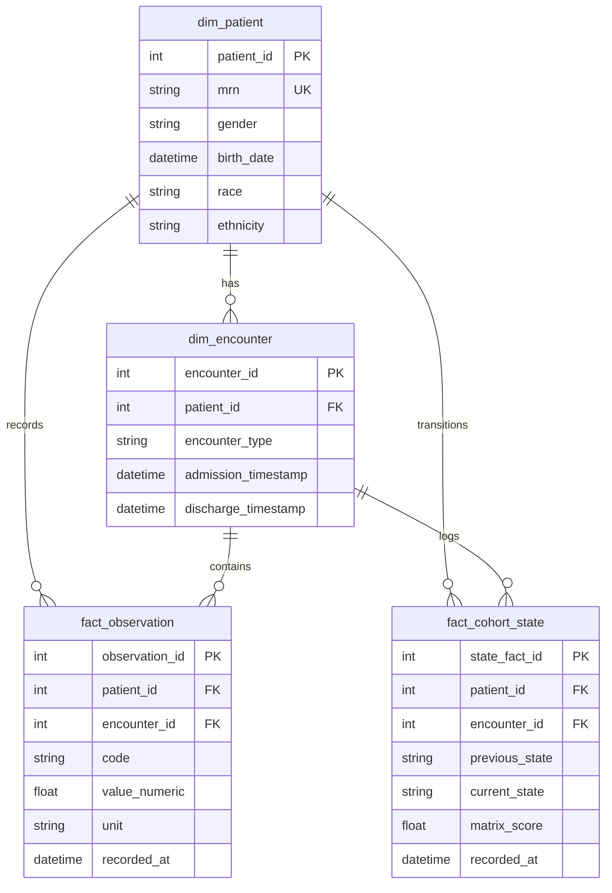
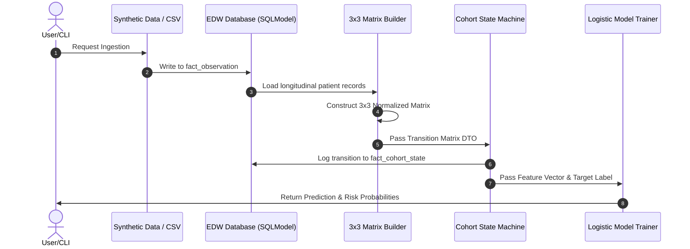
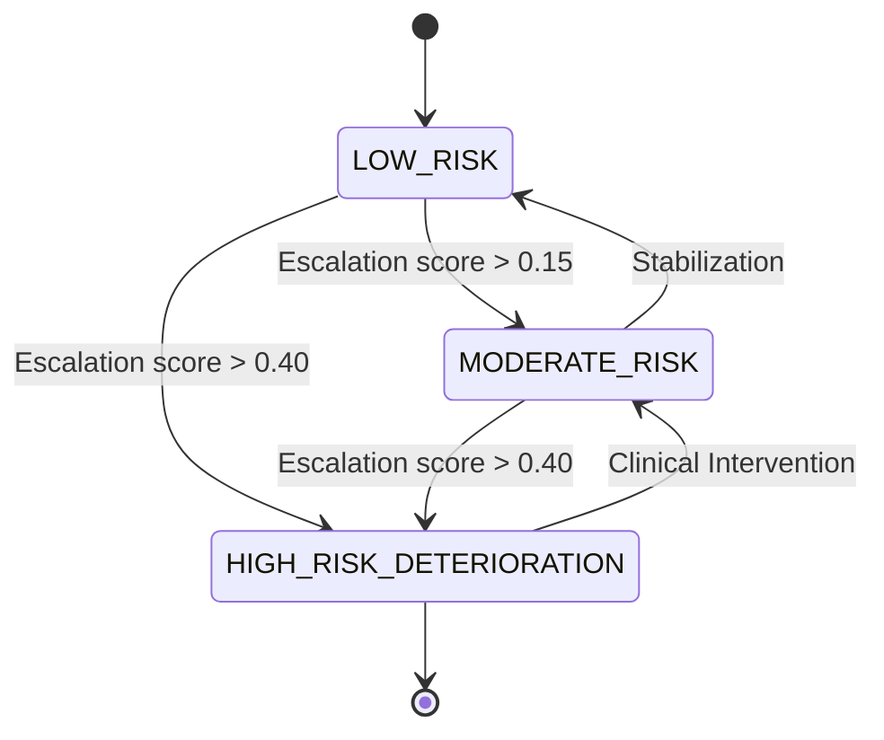

# System Architecture & Diagrams

## 1. Dimensional Star Schema (ERD)

```mermaid
erDiagram
    dim_patient ||--o{ dim_encounter : "has"
    dim_patient ||--o{ fact_observation : "records"
    dim_patient ||--o{ fact_cohort_state : "transitions"
    dim_encounter ||--o{ fact_observation : "contains"
    dim_encounter ||--o{ fact_cohort_state : "logs"

    dim_patient {
        int patient_id PK
        string mrn UK
        string gender
        datetime birth_date
        string race
        string ethnicity
    }

    dim_encounter {
        int encounter_id PK
        int patient_id FK
        string encounter_type
        datetime admission_timestamp
        datetime discharge_timestamp
    }

    fact_observation {
        int observation_id PK
        int patient_id FK
        int encounter_id FK
        string code
        float value_numeric
        string unit
        datetime recorded_at
    }

    fact_cohort_state {
        int state_fact_id PK
        int patient_id FK
        int encounter_id FK
        string previous_state
        string current_state
        float matrix_score
        datetime recorded_at
    }
```

---

## 2. End-to-End Data Flow

```mermaid
sequenceDiagram
    autonumber
    actor User/CLI
    participant Gen as Synthetic Data / CSV
    participant DW as EDW Database (SQLModel)
    participant MB as 3x3 Matrix Builder
    participant SM as Cohort State Machine
    participant ML as Logistic Model Trainer

    User/CLI->>Gen: Request Ingestion
    Gen->>DW: Write to fact_observation
    DW->>MB: Load longitudinal patient records
    MB->>MB: Construct 3x3 Normalized Matrix
    MB->>SM: Pass Transition Matrix DTO
    SM->>DW: Log transition to fact_cohort_state
    SM->>ML: Pass Feature Vector & Target Label
    ML->>User/CLI: Return Prediction & Risk Probabilities
```

---

## 3. Cohort State Machine Diagram

```mermaid
stateDiagram-v2
    [*] --> LOW_RISK
    LOW_RISK --> MODERATE_RISK : Escalation score > 0.15
    LOW_RISK --> HIGH_RISK_DETERIORATION : Escalation score > 0.40
    MODERATE_RISK --> HIGH_RISK_DETERIORATION : Escalation score > 0.40
    MODERATE_RISK --> LOW_RISK : Stabilization
    HIGH_RISK_DETERIORATION --> MODERATE_RISK : Clinical Intervention
    HIGH_RISK_DETERIORATION --> [*]
```
